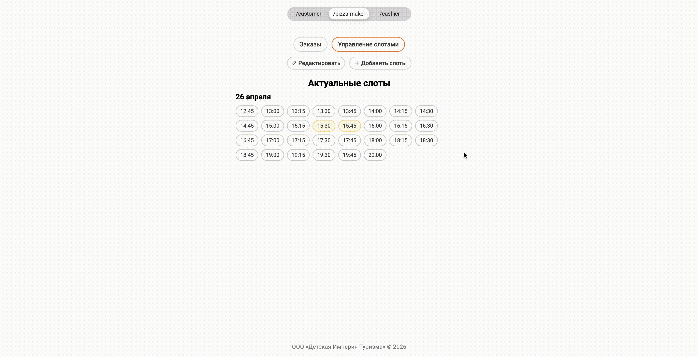
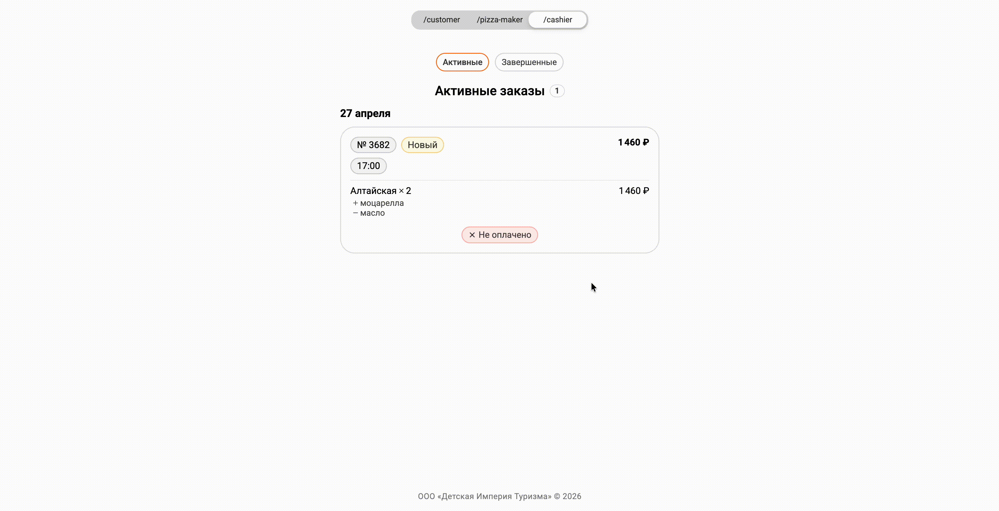

# Pizzeria Management App

Система для управления пиццерией – **[веб-приложение](https://we1r9.github.io/pizza-frontend/)** для реального бизнеса.

## О проекте

Приложение разрабатывается для пиццерии, функционирующей на территории частного центра детского отдыха [«Детская Империя Туризма»](https://www.detimperia.ru/).

Пиццерия работает по системе предзаказов: клиент выбирает блюда и удобный временной слот для получения заказа. Система структурирует поток заказов и связывает клиента с кухней в одном месте.

В приложении предусмотрено три пользовательские роли:

1. **Клиент** – выбирает время получения заказа, собирает заказ (предусмотрена кастомизация позиций), оплачивает (онлайн или при получении) и отслеживает статус заказа.
2. **Пицца-мейкер** – управляет расписанием слотов и статусами заказов.
3. **Кассир** – управляет статусами оплаты заказов.

Для удобства демонстрации переключение между ролями доступно прямо в интерфейсе.

## Демо


<p align="center"><strong>Клиент</strong>. Оформление заказа</p>


<p align="center"><strong>Пицца-мейкер</strong>. Управление слотами и статусом заказа</p>


<p align="center"><strong>Кассир</strong>. Управление статусом оплаты</p>


## Стек

- **React**
- **JavaScript** (постепенная миграция на TypeScript)
- **Vite**
- **CSS Modules**
- **Framer Motion**
- **Supabase**
- **Vitest**

## Установка и запуск

1. Клонируйте репозиторий:

```bash
git clone https://github.com/we1r9/pizza-frontend.git
cd pizza-frontend
```

2. Установите зависимости:

```bash
pnpm install
```

3. Создайте файл `.env` в корне проекта:

```env
VITE_SUPABASE_URL=supabase_url
VITE_SUPABASE_ANON_KEY=supabase_anon_key
```

4. Запустите приложение:

```bash
pnpm dev
```

## Тесты

```bash
pnpm test
```

## Технические подробности

- Проект структурирован по методологии **Feature-Sliced Design**. Код разделен на слои `app`, `pages`, `entities`, `shared`, что помогает разграничить ответственность между слоями и упрощает масштабирование.

- Глобальный стейт (активная роль, заказы и слоты) управляется через **React Context API**. Текущий масштаб проекта не требует сторонних библиотек.

- На текущем этапе навигация реализована **без роутера** через состояние: `activeRole` управляет переключением между интерфейсами клиента, пицца-мейкера и кассира; а `screen` – пошаговым флоу внутри роли клиента.

- Все приложение обернуто в **Error Boundary** – при неожиданном краше пользователь увидит понятный экран с кнопкой обновления.

- **Unit-тесты (Vitest)** покрывают основную бизнес-логику (бронирование слотов, валидация заказов, сортировка и форматирование данных).

- **Доступность (a11y).** Реализована семантическая верстка, используются ARIA-атрибуты и поддерживается навигация с клавиатуры.

- Переходы между экранами анимированы при помощи **Framer Motion**.

- **Supabase** используется как временный бэкенд (PostgreSQL + готовый REST API), что позволяет сосредоточиться на frontend-части без затрат на серверную инфраструктуру.

## Планы

- Переход на собственный бэкенд (Node.js)
- Авторизация и аутентификация с разграничением доступа по ролям
- URL-маршрутизация через React Router – разные роли получат отдельные защищенные точки входа
- Миграция на TypeScript
- Интеграция платежной системы для онлайн оплаты заказов
- Уведомления для пицца-мейкера о новых заказах через мессенджер
- Интеграционные тесты для ключевых пользовательских флоу

## Контакты

- Telegram: [@we1r9](https://t.me/we1r9)
- Email: provatorovandrew@gmail.com
